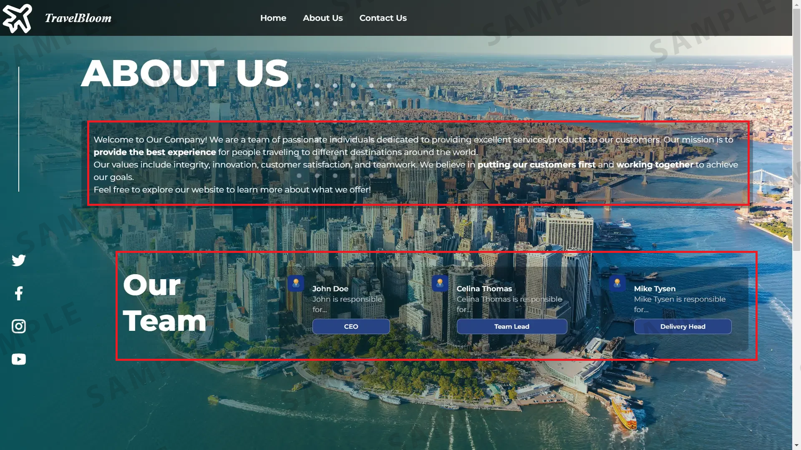
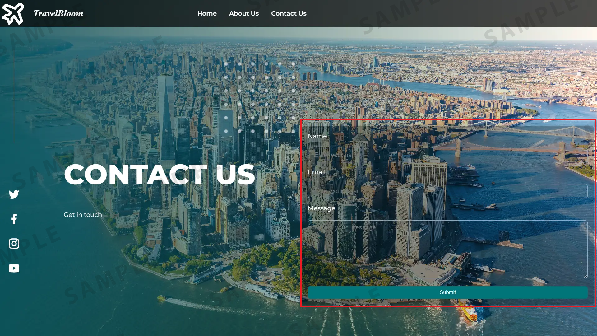

# Travel Recommendation Web Application
[_Check out the deployed solution on GitHub pages_](https://laurarnichols.github.io/travelRecommendationSite/)

This project was developed as part of a Coursera class on JavaScript. The goal of the assignment was to create a fully functional travel recommendation web application using only built-in functionality in HTML, CSS, and JavaScript. Inspiration images for the Home, About Us, and Contact Us pages were provided as part of the assignment, but all actual implementation, including sourcing and styling images, was completed independently. 

---

## Overview

The Travel Recommendation Web Application allows users to:

- Navigate between the Home, About Us, and Contact Us pages using a navigation bar.
- Search for travel recommendations by keyword (e.g., "beach," "temple," or "Australia").
- View travel recommendations with images and descriptions based on their search.
- Reset the search results.
- View a contact form that would be used to get in touch with the company.

---

## Requirements

The following were the core requirements for this project:

1. **Navigation Bar**:

   - Include links for Home, About Us, and Contact Us pages.
   - Add a search bar with Search and Clear buttons.

2. **Home Page**:

   - Add a background image and an introduction to the website.

3. **About Us Page**:

   - Provide company information.
   - Display team member names and roles.

4. **Contact Us Page**:

   - Include a form with fields for name, email, and message, plus a Submit button.

5. **Recommendations**:

   - Fetch data from a `travel_recommendation_api.json` file using the Fetch API.
   - Display at least two recommendations for each keyword (beach, temple, country name) with an image and description.

6. **Keyword Searches**:

   - Implement logic to handle variations of keywords (e.g., case-insensitive matches).

7. **Clear Button**:

   - Add functionality to reset the displayed results.

---

## Features

- Fully responsive and functional web application.
- Keywords entered into the search bar fetch corresponding recommendations dynamically using JavaScript.
- Recommendations include images and text descriptions.
- Built entirely using HTML, CSS, and JavaScript without any external libraries or frameworks.

---

## Inspiration Images

Below are three inspiration images provided as part of the assignment:

### Home Page

### About Us Page

### Contact Us Page

---

## Additional Information

The project demonstrates proficiency in:

- Creating structured HTML and CSS layouts.
- Writing functional JavaScript code for dynamic user interactions.
- Using the Fetch API to handle data retrieval.
- Developing responsive and user-friendly web interfaces.

All images and design elements were sourced independently and adapted to align with the provided inspiration. The completed project reflects the ability to build a cohesive and interactive web application from scratch.

---

## License

This project is for educational purposes only and follows the guidelines of the Coursera assignment.

